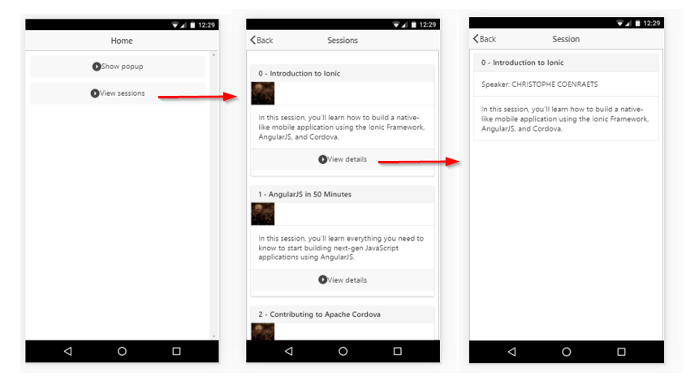

# ionic-demo
Node backend + Ionic app

To run:

1. In one console window, run:

	`cd server`

	`npm install`

	`node server.js`

2. In another console window, run:

	`cd myApp`

	`ionic build android`

Three options: 

1. `ionic emulate android` to use an emulator (need to have the Android SDK installed)
2. `ionic run android --livereload` if an Android device is connected and developer mode has been enabled in it
3. `ionic serve --livereload` to view in local browser

Final result:

